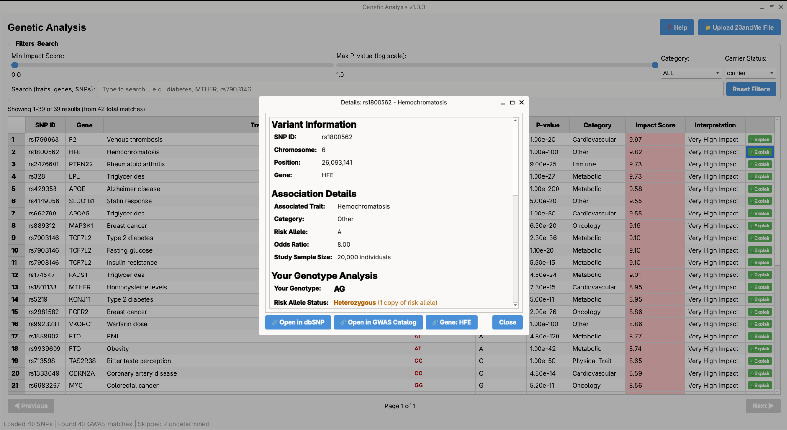

# Genetic Analysis Desktop Application

A PyQt6-based desktop application for analyzing 23andMe genetic data against the GWAS Catalog, now featuring polygenic risk score analysis.



## Features

### Monogenic Analysis (Tab 1)
- Upload 23andMe raw data files (.txt format)
- Parse and validate SNP data
- Match user SNPs against GWAS Catalog database
- Display results in sortable, paginated table
- Show: SNP ID, Gene, Trait, User Genotype, Risk Allele, P-value
- Impact Score calculation (0-10 scale)
- Real-time filtering:
  - Minimum impact score slider
  - Maximum p-value slider (log scale)
  - Trait category dropdown
  - Carrier status filter
  - Free text search (traits, genes, SNPs)
- Sort by any column
- Visual indicators for risk alleles
- Detailed explanation dialog for each result

### Polygenic Risk Scores (Tab 2) - NEW
- Browse available polygenic risk scores by trait
- Filter scores by category and search by trait name
- Compute all polygenic scores for your genotype
- Background pre-computation for instant browsing
- View detailed results including:
  - Population distribution visualization
  - User percentile position
  - Risk category (Low/Intermediate/High)
  - Variant coverage statistics
  - Top contributing variants
  - Scientific context and study details
- Quality warnings for low coverage
- Population-specific considerations

### Database Management (Tab 3) - NEW
- View current database versions
- See record counts and last update dates
- Create backups before updates
- Track update history

## Installation

```bash
# Create virtual environment (recommended)
python -m venv venv
source venv/bin/activate  # On Windows: venv\Scripts\activate

# Install dependencies
pip install -r requirements.txt

# Setup databases (creates GWAS and PGS sample data)
python database/setup_database.py

# Run the application
python main.py
```

## Requirements

- Python 3.9+
- PyQt6 6.7.0
- pandas 2.2.0
- numpy 1.24.4

## Project Structure

```
genexplore/
├── main.py                    # Application entry point
├── config.py                  # Configuration constants
├── requirements.txt           # Python dependencies
├── sample_23andme.txt         # Sample data file for testing
│
├── database/
│   ├── setup_database.py      # GWAS database setup
│   ├── polygenic_database.py  # PGS database management
│   ├── gwas.db               # GWAS SQLite database (generated)
│   ├── pgs.db                # PGS SQLite database (generated)
│   └── backups/              # Database backups
│
├── backend/
│   ├── parsers.py            # 23andMe file parser
│   ├── search_engine.py      # GWAS matching and search
│   ├── scoring.py            # Monogenic impact score calculation
│   ├── polygenic_scoring.py  # Polygenic risk score engine
│   └── validators.py         # Input validation
│
├── frontend/
│   ├── main_window.py        # PyQt6 main window with tabs
│   └── polygenic_widgets.py  # Polygenic analysis UI components
│
├── models/
│   ├── data_models.py        # Monogenic data classes
│   └── polygenic_models.py   # Polygenic data classes
│
├── utils/
│   ├── logging_config.py     # Logging setup
│   └── file_utils.py         # File utilities
│
├── tests/
│   ├── test_parsers.py           # Parser tests
│   ├── test_scoring.py           # Monogenic scoring tests
│   ├── test_search_engine.py     # Search engine tests
│   ├── test_polygenic_scoring.py # Polygenic scoring tests
│   └── test_polygenic_database.py # Polygenic database tests
│
└── logs/
    └── app.log               # Application log (generated)
```

## Usage

### Monogenic Analysis
1. **Start the application**: `python main.py`
2. **Upload file**: Click "Upload 23andMe File" and select your raw data file
3. **View results**: Browse matches in the results table
4. **Filter results**: Use sliders, dropdowns, and search box
5. **Sort results**: Click any column header
6. **See details**: Click "Explain" button for detailed information

### Polygenic Analysis
1. **Load genetic data**: Upload a 23andMe file (same file works for both tabs)
2. **Switch to Polygenic tab**: Click "📊 Polygenic Scores" tab
3. **Compute scores**: Click "🧬 Compute All Scores" button
4. **Browse results**: Scores are computed in background and appear progressively
5. **View details**: Click "📊 View" to see detailed analysis with distribution plot
6. **Filter**: Use category dropdown and search to find specific traits

## Polygenic Risk Score Calculation

Polygenic scores combine the effects of multiple genetic variants:

```
PRS = Σ (effect_weight × allele_count)
```

Where:
- **effect_weight**: Beta coefficient from GWAS
- **allele_count**: Number of effect alleles (0, 1, or 2)

Results are normalized against a reference population distribution and converted to percentiles.

### Risk Categories
- **Low Risk**: < 20th percentile
- **Intermediate Risk**: 20th - 79th percentile
- **High Risk**: ≥ 80th percentile

### Coverage Warnings
A warning is shown if less than 80% of the score's variants are found in your genotype, as this may affect accuracy.

## Impact Score Calculation (Monogenic)

The monogenic impact score (0-10) combines:

1. **P-value significance**: Lower p-values = higher impact
2. **Allele frequency**: Rarer variants = higher impact

```
score_p_value = min(-log10(p_value) / 10, 1.0) × 7.0
score_af = (1 - allele_frequency) × 3.0
impact_score = clamp(score_p_value + score_af, 0, 10)
```

## Running Tests

```bash
# Run all tests
python -m pytest tests/ -v

# Run specific test file
python -m pytest tests/test_polygenic_scoring.py -v

# Run with coverage
python -m pytest tests/ --cov=backend --cov=models --cov=database
```

## 23andMe File Format

The parser accepts tab-separated files with format:
```
# Comments start with #
rsid	chromosome	position	genotype
rs3131972	1	694713	GG
rs12124819	1	713790	AG
```

- **rsid**: SNP identifier (rs followed by numbers)
- **chromosome**: 1-22, X, Y, or MT
- **position**: Genomic position (positive integer)
- **genotype**: Two alleles (e.g., AA, AT, GG)
- Lines with genotype "--" (undetermined) are skipped

## Databases

### GWAS Database
- 100+ variant entries from GWAS Catalog
- Categories: Metabolic, Cardiovascular, Neuropsychiatric, Physical Trait, Oncology, Immune, Infectious, Other
- Population allele frequencies (overall, EUR, AFR, EAS, AMR)

### Polygenic Score Database
- 8 sample polygenic risk scores
- Categories: Type 2 Diabetes, CAD, Breast/Prostate Cancer, BMI, Alzheimer's, Rheumatoid Arthritis, Height
- Population distributions for percentile calculation
- Version tracking for updates

To recreate databases:
```bash
python database/setup_database.py --drop
```

## Logging

Logs are written to `logs/app.log`:
- Console: INFO level
- File: DEBUG level with rotation (10MB max, 5 backups)
- Errors also written to `error.log`

## Troubleshooting

**Database not found error:**
```bash
python database/setup_database.py
```

**No matches found:**
- Ensure the 23andMe file format is correct
- Check that variants exist in the GWAS database

**UI not responding:**
- The application uses background threading for processing
- Large files may take a few seconds to process

**Low polygenic score coverage:**
- Not all variants may be present in your genotype file
- Scores with <80% coverage show a warning
- Results are still computed but may be less accurate

## License

This project is for educational and research purposes.

## Disclaimer

⚠️ **This application is for informational and educational purposes only.**

Results should NOT be used for medical diagnosis or treatment decisions. Genetic associations are complex and influenced by many factors including environment, lifestyle, and gene-gene interactions.

Always consult with qualified healthcare professionals and genetic counselors for interpretation of genetic data.
